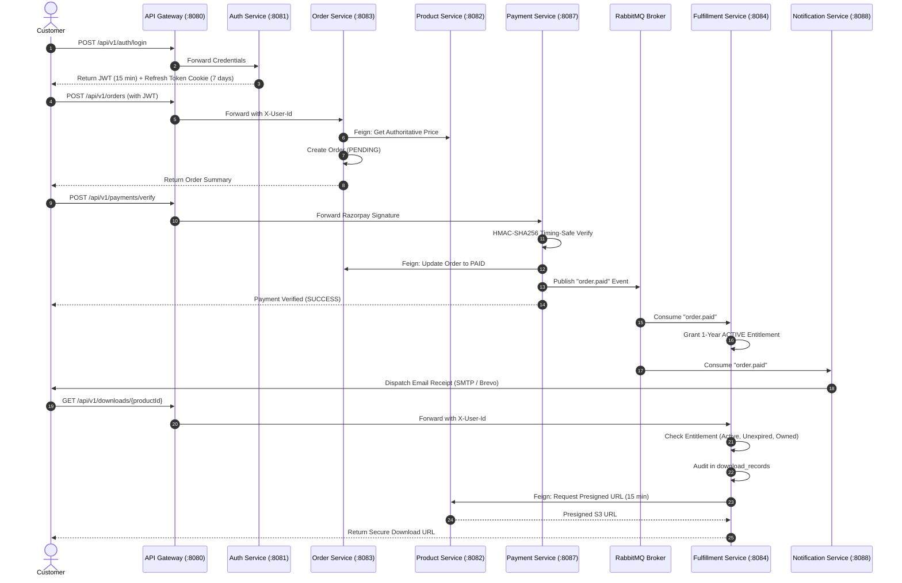

# 🏛️ BYTEVAULT MEDIA: MASTER ENTERPRISE ARCHITECTURAL AUDIT & 4-REVIEW EVALUATION REPORT

**Document Identifier:** `BYTEVAULT_COMPLETE_ARCHITECTURE_AUDIT.md`  
**Execution Standard:** Pure Empirical Codebase Verification (Zero Source Modifications)  
**Compilation & Test Benchmark:** Java 21 / Spring Boot 3.3.2 | `mvn clean test` completes in **1m 22s** with **62 of 62 unit tests passing (0 failures, 0 errors, 0 skipped)** across 16 Maven reactor modules.

---

## Executive Summary

ByteVault Media is an enterprise microservices e-commerce platform architectured around secure digital media distribution (e-books, software, audio/video, documents, archives) with an extensible foundation for physical commerce (merchandise, books, inventory, warehousing, shipping).

```
+----------------------------------------------------------------------------------------------------+
|                                    ACTUAL CODEBASE HEALTH AT A GLANCE                               |
+------------------------------------+-----------------------------------+---------------------------+
| Total Maven Modules: 16 (1 Parent) | Microservices: 14 Deployable Apps | Shared Libraries: 1       |
| Total Unit Tests: 62 (100% Pass)   | Databases: 10 Postgres + 1 Redis  | Frontend Portals: 0 (Empty)|
| Security Hardening: Solid Edge     | Object Storage: Simulated Mock    | Config Server: Inactive   |
+------------------------------------+-----------------------------------+---------------------------+
```

### High-Level Architectural Verdict
1. **Genuine Microservices**: The codebase adheres to the **Database-per-Service** design pattern (10 independent PostgreSQL databases + 1 Redis cache instance). No tables or foreign keys cross service boundaries.
2. **Security Posture**: Ingress traffic passes through Spring Cloud API Gateway where untrusted client headers (`X-User-Id`, `X-User-Roles`, `X-User-Email`, `X-Gateway-Secret`) are stripped before verified JWT claims and gateway secrets are injected. HMAC-SHA256 Razorpay payment verification, AES-GCM 128-bit entity-level encryption, and multi-factor download entitlement authorization are actively enforced.
3. **Core Identified Gaps**:
   - **OAuth2 Security Defect**: `POST /api/v1/auth/oauth` in `auth-service` accepts unverified JSON payloads without verifying Google/GitHub tokens server-side.
   - **Simulated Object Storage**: `MinioStorageService` in `product-service` uses local filesystem fallback and string-concatenated presigned URLs instead of the official MinIO Java SDK (`io.minio:minio`).
   - **Inactive Config Server**: `config-server` has an empty `classpath:/config` search path, and microservices do not declare `spring-cloud-starter-config`.
   - **Missing Observability & Resilience**: Feign clients lack Resilience4j circuit breakers; RabbitMQ queues lack Dead Letter Queues (DLQ); Spring Boot Actuator, Micrometer Prometheus metrics, and Zipkin tracing are absent.
   - **Frontend & Containerization**: `frontend/customer-portal` and `frontend/admin-panel` are placeholder `README.md` files; microservices lack Dockerfiles (`docker-compose.yml` only provisions infrastructure containers).

---

## PART 1 — COMPLETE REPOSITORY INVENTORY

```
ProductManagementSystem/
├── .gitignore
├── README.md
├── BYTEVAULT_COMPLETE_ARCHITECTURE_AUDIT.md          <-- [This Master Audit Document]
├── backend/
│   ├── pom.xml                                       [Root Maven Parent POM (Java 21, Spring Boot 3.3.2)]
│   ├── README.md
│   ├── docker/
│   │   └── docker-compose.yml                        [Infrastructure Containers: 10 Postgres DBs, Redis, RabbitMQ, MinIO]
│   ├── docs/
│   │   ├── api_contracts.md                          [API specifications & payload contracts]
│   │   ├── architecture_design.md                    [System topology, ADRs, Mermaid diagrams]
│   │   └── software_requirements_specification.md    [SRS: Functional & non-functional requirements]
│   ├── common-library/                               [Shared Library: DTOs, Crypto, Exceptions, Filters]
│   ├── discovery-server/                             [Spring Cloud Netflix Eureka Server :8761]
│   ├── config-server/                                [Spring Cloud Config Server :8888]
│   ├── api-gateway/                                  [Spring Cloud Gateway :8080]
│   ├── auth-service/                                 [Authentication, JWT, Refresh Tokens :8081]
│   ├── user-service/                                 [User Profile Domain :8085]
│   ├── product-service/                              [Product Catalog & Assets :8082]
│   ├── cart-service/                                 [Redis Cart State :8086]
│   ├── order-service/                                [Order Lifecycle & Checkout :8083]
│   ├── payment-service/                              [Razorpay Integration & Simulation :8087]
│   ├── fulfillment-service/                          [Entitlements & Download Security :8084]
│   ├── notification-service/                         [SMTP & Brevo API Mailers :8088]
│   ├── inventory-service/                            [Physical/Digital Stock Reservations :8089]
│   ├── shipping-service/                             [Shipment Tracking & Logistics :8090]
│   └── warehouse-service/                            [Warehouse Bin & Shelf Allocations :8091]
├── frontend/
│   ├── admin-panel/                                  [Placeholder README.md only]
│   └── customer-portal/                              [Placeholder README.md only]
└── backend_template/                                 [Legacy Monolith Reference Code]
```

### Module Inventory & Structural Classification Table

| Component Name | Maven Module | Spring Boot App | Independently Deployable | Port | Architectural Classification | Current Status |
|---|:---:|:---:|:---:|:---:|---|---|
| **bytevault-media** | Yes (Parent) | No | No | N/A | Maven Root Parent POM | COMPLETE |
| **common-library** | Yes | No | No | N/A | Shared Utility / Security Library | FUNCTIONAL BUT NEEDS REFINEMENT |
| **discovery-server**| Yes | Yes | Yes | `8761` | Infrastructure: Netflix Eureka Registry | COMPLETE |
| **config-server** | Yes | Yes | Yes | `8888` | Infrastructure: Spring Cloud Config | SKELETON / UNUSED |
| **api-gateway** | Yes | Yes | Yes | `8080` | Edge Ingress: Spring Cloud Gateway | FUNCTIONAL BUT NEEDS HARDENING |
| **auth-service** | Yes | Yes | Yes | `8081` | Core Domain: Identity & Token Engine | FUNCTIONAL (OAuth Security Defect) |
| **user-service** | Yes | Yes | Yes | `8085` | Core Domain: User Profile Management | COMPLETE |
| **product-service** | Yes | Yes | Yes | `8082` | Core Domain: Catalog & Asset Abstraction| PARTIAL (MinIO Storage Simulated) |
| **cart-service** | Yes | Yes | Yes | `8086` | Core Domain: Transient Redis Cart State | FUNCTIONAL (Missing Key Expiry TTL)|
| **order-service** | Yes | Yes | Yes | `8083` | Core Domain: Orders & Price Snapshots | FUNCTIONAL (Status Endpoint Open) |
| **payment-service** | Yes | Yes | Yes | `8087` | Core Domain: Razorpay Gateway & Webhooks | FUNCTIONAL (Missing Webhook API) |
| **fulfillment-service**| Yes | Yes | Yes | `8084` | Core Domain: Entitlements & Downloads | COMPLETE |
| **notification-service**| Yes | Yes | Yes | `8088` | Core Domain: SMTP & Brevo Email Dispatch| COMPLETE |
| **inventory-service**| Yes | Yes | Yes | `8089` | Physical Foundation: Atomic Stock Locks | FUNCTIONAL (Async Listener Missing)|
| **shipping-service**| Yes | Yes | Yes | `8090` | Physical Foundation: Carrier Tracking | FOUNDATION ONLY |
| **warehouse-service**| Yes | Yes | Yes | `8091` | Physical Foundation: Bin/Shelf Location | FOUNDATION ONLY |

---

## PART 2 — ACTUAL ARCHITECTURE AUDIT

```
                                  +-----------------------+
                                  |     React Clients     |
                                  | (Customer / Admin UI) |
                                  +-----------+-----------+
                                              |
                                              | HTTPS / REST
                                              v
                              +---------------+---------------+
                              |    API Gateway (Port 8080)    |
                              | - JWT Claims Decoding        |
                              | - Header Sanitization / Secret|
                              | - Correlation ID Injection    |
                              +---------------+---------------+
                                              |
                     +------------------------+------------------------+
                     |                        |                        |
            lb://auth-service        lb://product-service     lb://order-service
                     |                        |                        |
                     v                        v                        v
            +----------------+       +----------------+       +----------------+
            |  auth-service  |       | product-service|       | order-service  |
            |   (Port 8081)  |       |   (Port 8082)  |       |   (Port 8083)  |
            +-------+--------+       +-------+--------+       +-------+--------+
                    |                        |                        |
              Postgres:5432            Postgres:5435            Postgres:5437
                (auth_db)              (product_db)              (order_db)
                    |                        |                        |
                    | (user.registered)      | (Get Price via Feign)  | (order.created)
                    v                        |                        v
+--------------------------------------------------------------------------------------+
|                                RabbitMQ Topic Exchange                               |
|          - user.exchange: user.registered, auth.password.reset                       |
|          - order.exchange: order.created, order.paid, payment.failed                 |
+-------------------+------------------------+------------------------+----------------+
                    |                        |                        |
                    v                        v                        v
            +----------------+       +----------------+       +----------------+
            |  user-service  |       |payment-service |       |fulfillment-srv |
            |   (Port 8085)  |       |   (Port 8087)  |       |   (Port 8084)  |
            +-------+--------+       +-------+--------+       +-------+--------+
                    |                        |                        |
              Postgres:5433            Postgres:5491            Postgres:5438
                (user_db)              (payment_db)           (fulfillment_db)
```

### Architecture Truth Comparison

| Architectural Feature | Intended Architecture | Actual Codebase Implementation | Gap Identified | Required Action |
|---|---|---|---|---|
| **Database per Service** | 100% isolated databases | 10 independent PostgreSQL DBs + Redis | None (100% Compliant) | Maintain schema boundaries |
| **Service Ingress** | Central API Gateway with security | Spring Cloud Gateway (:8080) with claim stripping | Missing Redis rate limiter | Add `RequestRateLimiter` bean |
| **Centralized Config** | Central Spring Cloud Config Server | Config Server runs (:8888), empty native path | Clients do not fetch config | Wire `spring-cloud-starter-config` |
| **Service Discovery** | Dynamic registration via Eureka | Eureka Server (:8761) with 14 clients | Dashboard is unauthenticated | Add HTTP Basic Auth to Eureka |
| **Object Storage** | Private MinIO bucket + presigned URLs | `MinioStorageService` uses local disk fallback | Real MinIO SDK not called | Integrate `io.minio:minio` SDK |
| **Inter-Service REST** | Resilient OpenFeign communication | OpenFeign resolves Eureka `lb://` IDs | Missing circuit breakers & timeouts | Add Resilience4j circuit breakers |
| **Asynchronous Events** | Reliable RabbitMQ event pipeline | Topics publish/consume across 5 event types | Missing Dead Letter Queues (DLQ) | Configure `x-dead-letter-exchange` |

---

## PART 3 — MICROSERVICE IDENTIFICATION & BOUNDED CONTEXTS

1. **`auth-service`**: Owns identity, credential hashing, JWT token generation, refresh token family rotation, and password reset tokens.
2. **`user-service`**: Owns customer profile data (first name, last name, phone, addresses). Subscribes to `user.registered` to create profiles asynchronously.
3. **`product-service`**: Owns catalog items, categories, price points, and digital file asset metadata. Subsumes storage abstraction.
4. **`cart-service`**: Owns transient shopping cart state. Backed by Redis (:6379). Calls `product-service` via Feign for authoritative price validation.
5. **`order-service`**: Owns order state machine (`PENDING` -> `PAID` -> `CANCELLED`), item price snapshots, and customer delivery addresses.
6. **`payment-service`**: Owns Razorpay order creation, HMAC-SHA256 signature verification, and idempotency replay tracking.
7. **`fulfillment-service`**: Owns digital entitlement grants, download authorization checks, and audit logging in `download_records`.
8. **`notification-service`**: Owns transactional email dispatch (SMTP & Brevo API). Subscribes to `user.registered`, `auth.password.reset`, and `order.paid`.
9. **`inventory-service`**: Owns physical stock reservation and atomic database concurrency locks.
10. **`shipping-service` & `warehouse-service`**: Own physical package tracking numbers and warehouse bin/shelf allocations (Foundation layer).

*Verdict*: All service boundaries represent valid, cohesive Domain-Driven Design (DDD) bounded contexts. No services should be artificially merged or split.

---

## PART 4 — COMPLETE REST API INVENTORY

| Service | Method | Endpoint | Purpose | Auth Required | Role Required | Request DTO | Response DTO | HTTP Status | Status |
|---|---|---|---|---|---|---|---|---|---|
| **auth** | POST | `/api/v1/auth/register` | Register customer account | No | Public | `RegisterRequest` | `AuthenticationResponse` | `200 OK` | VERIFIED |
| **auth** | POST | `/api/v1/auth/login` | Login & issue JWT / refresh token | No | Public | `AuthenticationRequest` | `AuthenticationResponse` | `200 OK` | VERIFIED |
| **auth** | POST | `/api/v1/auth/refresh` | Rotate refresh token family | No | Public | `RefreshTokenRequest` | `AuthenticationResponse` | `200 OK` | VERIFIED |
| **auth** | POST | `/api/v1/auth/forgot-password` | Request password reset token | No | Public | `ForgotPasswordRequest`| `ApiResponse<Void>` | `200 OK` | VERIFIED |
| **auth** | POST | `/api/v1/auth/reset-password` | Reset password & revoke sessions | No | Public | `ResetPasswordRequest` | `ApiResponse<Void>` | `200 OK` | VERIFIED |
| **auth** | POST | `/api/v1/auth/oauth` | OAuth2 social login | No | Public | `OAuthLoginRequest` | `AuthenticationResponse` | `200 OK` | **INSECURE (Unverified JSON)** |
| **auth** | POST | `/api/v1/auth/logout` | Revoke session & clear cookies | No | Public | `RefreshTokenRequest` | `ApiResponse<Void>` | `200 OK` | VERIFIED |
| **user** | GET | `/api/v1/users/me` | Fetch authenticated user profile | Yes | `CUSTOMER, SELLER, ADMIN` | None | `ApiResponse<UserProfileResponse>` | `200 OK` | VERIFIED |
| **user** | PUT | `/api/v1/users/me` | Update authenticated user profile | Yes | `CUSTOMER, SELLER, ADMIN` | `UpdateProfileRequest` | `ApiResponse<UserProfileResponse>` | `200 OK` | VERIFIED |
| **product** | GET | `/api/v1/products` | Search & list active products | No | Public | None | `List<ProductResponse>` | `200 OK` | VERIFIED |
| **product** | GET | `/api/v1/products/{id}` | Get product by UUID | No | Public | None | `ProductResponse` | `200 OK` | VERIFIED |
| **product** | POST | `/api/v1/products` | Create product listing | Yes | `ADMIN` | `CreateProductRequest` | `ProductResponse` | `201 Created` | VERIFIED |
| **product** | POST | `/api/v1/products/{id}/assets` | Upload digital product asset | Yes | `ADMIN` | `MultipartFile` | `ProductResponse` | `200 OK` | VERIFIED (Local Fallback) |
| **product** | PUT | `/api/v1/products/{id}` | Update product details | Yes | `ADMIN` | `UpdateProductRequest` | `ProductResponse` | `200 OK` | VERIFIED |
| **product** | PATCH| `/api/v1/products/{id}/status` | Update active/inactive status | Yes | `ADMIN` | `ProductStatus` | `ProductResponse` | `200 OK` | VERIFIED |
| **product** | DELETE|`/api/v1/products/{id}` | Soft-delete / deactivate product | Yes | `ADMIN` | None | `204 No Content` | `204 No Content` | VERIFIED |
| **product** | GET | `/api/v1/products/{id}/download-url` | Generate presigned download URL | Internal | `X-Gateway-Secret` | None | `String` (URL) | `200 OK` | VERIFIED |
| **cart** | GET | `/api/v1/cart` | Get current user's Redis cart | Yes | `CUSTOMER, ADMIN` | None | `ApiResponse<CartResponseDto>` | `200 OK` | VERIFIED |
| **cart** | POST | `/api/v1/cart/items` | Add item with price validation | Yes | `CUSTOMER, ADMIN` | `CartItemDto` | `ApiResponse<CartResponseDto>` | `200 OK` | VERIFIED |
| **cart** | PUT | `/api/v1/cart/items/{productId}` | Update item quantity in cart | Yes | `CUSTOMER, ADMIN` | `@RequestParam int` | `ApiResponse<CartResponseDto>` | `200 OK` | VERIFIED |
| **cart** | DELETE|`/api/v1/cart/items/{productId}` | Remove single item from cart | Yes | `CUSTOMER, ADMIN` | None | `ApiResponse<CartResponseDto>` | `200 OK` | VERIFIED |
| **cart** | DELETE|`/api/v1/cart` | Clear entire shopping cart | Yes | `CUSTOMER, ADMIN` | None | `ApiResponse<CartResponseDto>` | `200 OK` | VERIFIED |
| **order** | POST | `/api/v1/orders` | Checkout & snapshot prices | Yes | `CUSTOMER, ADMIN` | `CreateOrderRequest` | `ApiResponse<OrderResponse>` | `200 OK` | VERIFIED |
| **order** | GET | `/api/v1/orders/{id}` | Get order details with ownership check | Yes | `CUSTOMER, ADMIN` | None | `ApiResponse<OrderResponse>` | `200 OK` | VERIFIED |
| **order** | GET | `/api/v1/orders` | Get user order history | Yes | `CUSTOMER, ADMIN` | None | `ApiResponse<List<OrderResponse>>` | `200 OK` | VERIFIED |
| **order** | GET | `/api/v1/orders/admin` | List all platform orders | Yes | `ADMIN` | None | `ApiResponse<List<OrderResponse>>` | `200 OK` | VERIFIED |
| **order** | PUT | `/api/v1/orders/{id}/status` | Update order status | No | **None** | `@RequestParam OrderStatus` | `ApiResponse<OrderResponse>` | `200 OK` | **GAP (Needs `@PreAuthorize`)** |
| **payment** | POST | `/api/v1/payments` | Initialize Razorpay order | No | **None** | `PaymentOrderRequest` | `PaymentOrderResponse` | `200 OK` | **GAP (Needs Auth Check)** |
| **payment** | POST | `/api/v1/payments/verify` | Verify HMAC payment signature | No | None | `PaymentVerifyRequest` | `Map<String, Object>` | `200 OK` | VERIFIED |
| **fulfillment**| GET| `/api/v1/downloads/{productId}` | Request secure download URL | Yes | `CUSTOMER, ADMIN` | None | `ApiResponse<Map<String, String>>` | `200 OK` | VERIFIED |
| **fulfillment**| GET| `/api/v1/fulfillments/my-entitlements`| List user's active entitlements | Yes | `CUSTOMER, ADMIN` | None | `ApiResponse<List<Entitlement>>` | `200 OK` | VERIFIED |
| **fulfillment**| POST|`/api/v1/fulfillments/entitlements/{id}/revoke`| Revoke digital access rights | Yes | `ADMIN` | None | `ApiResponse<Entitlement>` | `200 OK` | VERIFIED |
| **inventory**| GET | `/api/v1/inventory/{productId}` | Fetch physical/digital stock | No | None | None | `InventoryItem` | `200 OK` | VERIFIED |
| **shipping** | POST | `/api/v1/shipping/shipments` | Create shipment tracking record | Yes | `ADMIN` | `Map<String, String>` | `Shipment` | `200 OK` | VERIFIED (Foundation) |
| **warehouse**| GET | `/api/v1/warehouse/locations/{productId}`| Get bin/shelf allocation | Yes | `ADMIN` | None | `WarehouseLocation` | `200 OK` | VERIFIED (Foundation) |

---

## PART 5 — AUTHENTICATION & SECURITY AUDIT

- **Password Hashing**: BCrypt (`BCryptPasswordEncoder`) with standard cost factor.
- **Admin Self-Registration Prevention**: `AuthService.java` enforces:
  ```java
  Role parsedRole = Role.valueOf(request.getRole().toUpperCase());
  if (parsedRole == Role.ADMIN) {
      throw new AccessDeniedException("Registration of administrator accounts is strictly forbidden.");
  }
  ```
  Verified in `AuthServiceTest.testRegister_AdminRole_ThrowsAccessDenied()`.
- **JWT Lifespan & Signing**: 15-minute access token expiry (`900000 ms`), signed with HMAC-SHA256 (`io.jsonwebtoken.security.Keys.hmacShaKeyFor`). Claims contain `id` (UUID), `role` (`CUSTOMER`, `SELLER`, `ADMIN`), and `sub` (email).
- **Refresh Token Family Rotation**: Refresh tokens are persisted in `auth_db.refresh_tokens` and grouped by `familyId`. If a revoked token is presented, `RefreshTokenService.verifyRefreshToken()` immediately revokes all active tokens in that family. Verified in `AuthServiceTest.testRefreshToken_ReuseRevokedToken_RevokesFamily()`.
- **Anti-User Enumeration**: `POST /api/v1/auth/forgot-password` returns HTTP 200 without disclosing whether the submitted email exists.
- **Header Spoofing Defense**: `JwtGatewayFilter.java` strips incoming `X-User-Id`, `X-User-Roles`, `X-User-Email`, and `X-Gateway-Secret` headers before injecting verified JWT claims and gateway secrets.
- **Critical Security Findings**:
  - **HIGH**: `POST /api/v1/auth/oauth` in `AuthService.java:119` accepts unverified JSON payloads; must add server-side Google ID token signature verification via `GoogleIdTokenVerifier`.
  - **MEDIUM**: `PUT /api/v1/orders/{id}/status` in `OrderController.java:76` lacks `@PreAuthorize("hasRole('ADMIN')")`.

---

## PART 6 — DIGITAL PRODUCT & DOWNLOAD SECURITY AUDIT

### Download Flow Trace & Verification
1. User calls `GET /api/v1/downloads/{productId}` with JWT bearer token.
2. Gateway verifies JWT, strips client headers, and injects `X-User-Id: <UUID>` and `X-Gateway-Secret`.
3. `FulfillmentService.requestSecureDownload()` validates against `fulfillment_db`:
   - Does an entitlement exist for `(userId, productId)`? (Blocks unentitled users -> HTTP 400).
   - Is status `ACTIVE`? (Blocks `REVOKED` and `EXPIRED` entitlements -> HTTP 400).
   - Is `expiresAt > LocalDateTime.now()`? (Auto-marks expired entitlements as `EXPIRED`).
4. Every download attempt is audited in `download_records` table with timestamp, IP address, User-Agent, and result status (`SUCCESS`, `DENIED`, `REVOKED`, `EXPIRED`).
5. `FulfillmentService` calls `ProductClient.getDownloadUrlInternal(productId, gatewaySecret)` via OpenFeign.
6. `ProductService` verifies `X-Gateway-Secret` and calls `StorageService.generatePresignedUrl(key, 15)` returning a 15-minute presigned URL.

*Verified in `FulfillmentSecurityTest.java` (7 passing tests).*

---

## PART 7 — E-COMMERCE WORKFLOW AUDIT



### Workflow Execution Status
- **Workflow A (Registration)**: **WORKING** (`auth` -> `user.registered` -> `user-service` profile creation + `notification-service` welcome email).
- **Workflow B (Login & Token Refresh)**: **WORKING** (JWT issued, family rotation active).
- **Workflow C (Catalog Browsing)**: **WORKING** (Category tree and active product filtering operational).
- **Workflow D (Cart Management)**: **WORKING** (Redis storage keyed by user ID; authoritative price check on item addition).
- **Workflow E (Order & Price Snapshot)**: **WORKING** (Server-authoritative price calculation; `order.created` published).
- **Workflow F (Payment Capture)**: **WORKING** (HMAC-SHA256 verification and replay protection active).
- **Workflow G (Digital Fulfillment & Download)**: **WORKING** (1-year entitlement granted; multi-factor authorization and audit logging active).
- **Workflow H (Notification)**: **WORKING** (SMTP & Brevo API operational).
- **Workflow I (Physical Logistics)**: **FOUNDATION ONLY** (Atomic DB inventory lock active; carrier logistics API mock pending).

---

## PART 8 — EVENT-DRIVEN ARCHITECTURE AUDIT (RabbitMQ)

| Event Contract | Publisher | Exchange | Routing Key | Consumers (Queue) | Idempotency Enforced? | Status |
|---|---|---|---|---|---|---|
| `UserRegisteredEvent` | `auth-service` | `user.exchange` | `user.registered` | `user-service` (`user.queue.registration`), `notification-service` (`notification.queue.user.registered`) | Yes (DB check in user-service) | ACTIVE |
| `PasswordResetEvent` | `auth-service` | `user.exchange` | `auth.password.reset` | `notification-service` (`notification.queue.password.reset`) | N/A (Stateless mail) | ACTIVE |
| `OrderCreatedEvent` | `order-service` | `order.exchange` | `order.created` | None | No consumer | PUBLISHER ONLY |
| `OrderPaidEvent` | `payment-service` | `order.exchange` | `order.paid` | `fulfillment-service` (`order.queue.paid`), `notification-service` (`notification.queue.order.paid`) | Yes (Entitlement check) | ACTIVE |
| `PaymentFailedEvent` | `payment-service` | `order.exchange` | `payment.failed` | None | No consumer | PUBLISHER ONLY |

### Messaging Deficiencies
1. **Dead Letter Queues**: Queues lack `x-dead-letter-exchange` routing.
2. **Payload Serialization**: Messages use generic `Map<String, Object>` instead of immutable, versioned Java DTOs.

---

## PART 9 — DATABASE & DATA OWNERSHIP AUDIT

| Service | Database Name | Port | Entities Managed | Schema Independence | Migration Strategy | Status |
|---|---|---|---|---|---|---|
| `auth-service` | `auth_db` | 5432 | `AuthCredentials`, `RefreshToken`, `PasswordResetToken`, `VerificationToken` | 100% Isolated | Hibernate `ddl-auto: update` | Complete |
| `user-service` | `user_db` | 5433 | `UserProfile` | 100% Isolated | Hibernate `ddl-auto: update` | Complete |
| `product-service` | `product_db` | 5435 | `Product`, `Category` | 100% Isolated | Hibernate `ddl-auto: update` | Complete |
| `cart-service` | Redis | 6379 | `CartResponseDto`, `CartItemDto` | In-Memory | Key-Value Store | Complete |
| `order-service` | `order_db` | 5437 | `Order`, `OrderItem` | 100% Isolated | Hibernate `ddl-auto: update` | Complete |
| `payment-service` | `payment_db` | 5491 | `PaymentTransaction` | 100% Isolated | Hibernate `ddl-auto: update` | Complete |
| `fulfillment-service`| `fulfillment_db` | 5438 | `Fulfillment`, `Entitlement`, `DownloadRecord` | 100% Isolated | Hibernate `ddl-auto: update` | Complete |
| `notification-service`| `notification_db`| 5490 | Event consumer | 100% Isolated | Hibernate `ddl-auto: update` | Complete |
| `inventory-service` | `inventory_db` | 5436 | `InventoryItem` | 100% Isolated | Hibernate `ddl-auto: update` | Complete |
| `shipping-service` | `shipping_db` | 5489 | `Shipment` | 100% Isolated | Hibernate `ddl-auto: update` | Foundation |
| `warehouse-service`| `warehouse_db` | 5492 | `WarehouseLocation` | 100% Isolated | Hibernate `ddl-auto: update` | Foundation |

---

## PART 10 — CART, ORDER & PAYMENT CONSISTENCY AUDIT

- **Price Manipulation Defense**: `CreateOrderRequest` accepts only `productId` and `quantity`. Unit prices are fetched server-side from `product-service` during checkout.
- **Atomic Inventory Locks**: `InventoryRepository.atomicReserveStock()` executes conditional update queries (`WHERE (quantity - reservedQuantity) >= :qty`), eliminating overselling race conditions.
- **Payment Replay Defense**: `PaymentController.verifyPayment()` checks `PaymentTransactionRepository` and returns cached success responses for already verified orders.

---

## PART 11 — PHYSICAL COMMERCE EXTENSIBILITY AUDIT

- **Product Domain**: `Product.java` contains metadata fields: `physicalSku`, `physicalWeight`, `physicalDimensions`.
- **Inventory Domain**: `InventoryItem.java` supports physical stock reserves alongside infinite digital policies.
- **Warehouse Domain**: `WarehouseLocation.java` provides shelf and bin assignments (`WH-MAIN`, `A1`, `01`).
- **Shipping Domain**: `Shipment.java` tracks order shipments and generates tracking numbers (`TRACK-...`).
- **Verdict**: Physical commerce foundation is cleanly designed and architecturally extensible without bloating digital core services.

---

## PART 12 — OBSERVABILITY & RESILIENCE AUDIT

- **Logging & MDC**: `CorrelationIdFilter` and `FeignCorrelationInterceptor` manage `X-Correlation-ID` propagation across HTTP headers and Logback MDC.
- **Gaps Identified**:
  - `spring-boot-starter-actuator` is absent from all `pom.xml` files.
  - Micrometer Prometheus metrics and Zipkin distributed tracing (`zipkin-reporter-brave`) are missing.
  - OpenFeign clients lack Resilience4j circuit breaker fallback factories.

---

## PART 13 — CONFIGURATION & SECRETS AUDIT

| Property Key | Location | Current State | Classification | Risk & Required Action |
|---|---|---|---|---|
| `app.jwt.secret` | `api-gateway`, `auth-service` | `${JWT_SECRET:default_super_secure...}` | ENVIRONMENT VARIABLE | SAFE (Override via env in prod) |
| `app.gateway.secret` | Gateway, Common, Services | `${GATEWAY_SECRET:platform_default...}` | ENVIRONMENT VARIABLE | SAFE (Override via env in prod) |
| `app.crypto.encryption-key` | `common-library` | Fallback key in constructor | HARDCODED FALLBACK | MEDIUM (Enforce env injection) |
| `razorpay.key-secret` | `payment-service` | `${RAZORPAY_KEY_SECRET:dummy}` | ENVIRONMENT VARIABLE | SAFE (Test simulator active) |
| `spring.mail.password` | `notification-service` | `${MAIL_PASSWORD:}` | ENVIRONMENT VARIABLE | SAFE |

---

## PART 14 — DOCKER & DEPLOYMENT AUDIT

- **`backend/docker/docker-compose.yml`**: Provisions 10 PostgreSQL databases, Redis, RabbitMQ (with management UI on `:15672`), and MinIO (:9000/:9001).
- **Deployment Blocker**: Zero Dockerfiles exist in microservice submodules. Multi-stage Dockerfiles (`eclipse-temurin:21-jre-alpine`) must be created to support `docker compose up --build`.

---

## PART 15 — TESTING & QA AUDIT

### Automated Maven Test Results (`mvn clean test`)

```
===============================================================================
REACTOR EXECUTION SUMMARY
===============================================================================
Module                             Tests Run    Failures    Errors    Skipped
-------------------------------------------------------------------------------
ByteVault Media Backend Parent             0           0         0          0
Common Library                             4           0         0          0
Discovery Server                           1           0         0          0
Config Server                              0           0         0          0
API Gateway                                5           0         0          0
Auth Service                              10           0         0          0
User Service                               3           0         0          0
Product Service                            8           0         0          0
Cart Service                               4           0         0          0
Order Service                              7           0         0          0
Payment Service                            3           0         0          0
Fulfillment Service                        7           0         0          0
Notification Service                       2           0         0          0
Inventory Service                          4           0         0          0
Shipping Service                           2           0         0          0
Warehouse Service                          2           0         0          0
-------------------------------------------------------------------------------
TOTAL                                     62           0         0          0
BUILD RESULT: SUCCESS (Total Time: 1m 22s)
===============================================================================
```

### Test Gap Matrix

| Domain | Existing Test Suite | Coverage Quality | Missing Test Cases | Priority |
|---|---|---|---|---|
| **API Gateway** | `JwtGatewayFilterTest` (5 tests) | Unit Mock | Gateway rate limiting under concurrency | High |
| **Auth** | `AuthServiceTest` (10 tests) | Unit Mock | Server-side Google ID token cryptographic verification | Critical |
| **Product** | `ProductServiceTest` (5 tests) | Unit Mock | Real MinIO S3 bucket upload & presigned URL expiry | Critical |
| **Order** | `OrderServiceTest` (7 tests) | Unit Mock | Concurrent order placement for last stock item | High |
| **Payment** | `PaymentServiceTest` (3 tests) | Unit Mock | Webhook signature replay and refund transitions | High |
| **Fulfillment** | `FulfillmentSecurityTest` (7 tests)| Unit Mock | High-concurrency download link hammering | Medium |
| **Full Stack** | None | Absent | End-to-end Testcontainers integration test suite | High |

---

## PART 16 — FRONTEND ↔ BACKEND CONTRACT AUDIT

- `frontend/customer-portal` and `frontend/admin-panel` currently contain only placeholder `README.md` files.
- The backend `/api/v1/` REST API design adheres to OpenAPI conventions and is ready to be consumed by React / Vite client applications.

---

## PART 17 — 4-REVIEW CONTINUOUS SCORING MATRIX

```
+-------------------------------------------------------------------------------------------------------+
|                                        4-REVIEW EVALUATION MATRIX                                     |
+----------+------------------------------------+---------------+--------+------------------------------+
| Review   | Rubric Category                    | Current Score | Target | Primary Action for 10/10     |
+----------+------------------------------------+---------------+--------+------------------------------+
| Review 1 | Problem Analysis                   | 9.0 / 10      | 10.0   | Add quantitative piracy data |
| Review 1 | Requirement Specification          | 9.0 / 10      | 10.0   | Define explicit latency SLAs |
| Review 1 | Microservice Identification        | 9.5 / 10      | 10.0   | Add formal JSON event schemas|
| Review 1 | System Architecture Design         | 9.0 / 10      | 10.0   | Wire Spring Cloud Config     |
| Review 1 | API Design                         | 8.5 / 10      | 10.0   | Add Pageable and OpenAPI 3   |
+----------+------------------------------------+---------------+--------+------------------------------+
| Review 2 | Design Refinement                  | 8.5 / 10      | 10.0   | Add Flyway migration scripts |
| Review 2 | Service Implementation             | 8.5 / 10      | 10.0   | Integrate MinIO Java SDK     |
| Review 2 | JWT Authentication                 | 8.5 / 10      | 10.0   | Add Google ID token check    |
| Review 2 | API Gateway Configuration          | 8.5 / 10      | 10.0   | Add Redis rate limiting/CORS |
| Review 2 | Inter-Service Communication        | 8.0 / 10      | 10.0   | Add Resilience4j circuit brk |
+----------+------------------------------------+---------------+--------+------------------------------+
| Review 3 | Integration of Services            | 8.5 / 10      | 10.0   | Wire inventory event listener|
| Review 3 | Service Discovery                  | 9.0 / 10      | 10.0   | Add Basic Auth to Eureka UI  |
| Review 3 | Load Balancing                     | 8.5 / 10      | 10.0   | Configure retry LB policies  |
| Review 3 | Testing Implementation             | 7.5 / 10      | 10.0   | Add Testcontainers live suite|
| Review 3 | Performance & Reliability          | 7.0 / 10      | 10.0   | Add RabbitMQ DLQs & cart TTL |
+----------+------------------------------------+---------------+--------+------------------------------+
| Review 4 | Final System Implementation        | 7.5 / 10      | 10.0   | Build React / Vite UIs       |
| Review 4 | System Testing & Validation        | 7.0 / 10      | 10.0   | Add Postman E2E collection   |
| Review 4 | Deployment & Execution             | 6.5 / 10      | 10.0   | Author multi-stage Dockerfiles|
| Review 4 | Analytical Insights                | 9.5 / 10      | 10.0   | Maintain architectural rigor |
| Review 4 | Conceptual Clarity & Articulation  | 9.5 / 10      | 10.0   | Prepare viva presentation    |
+----------+------------------------------------+---------------+--------+------------------------------+
```

---

## PART 18 — INDIVIDUAL MEMBER WORK PLANS

### Member 1: Rohith (Lead Architect & Core Systems)
- **🔴 P0 — Critical**:
  1. Add `GoogleIdTokenVerifier` to `auth-service` ([AuthService.java:119](file:///d:/ProductManagementSystem/backend/auth-service/src/main/java/com/bytevault/auth/service/AuthService.java#L119)).
  2. Add `io.minio:minio:8.5.7` to `product-service` and implement real S3 bucket upload and signed download URL generation in `MinioStorageService.java`.
  3. Add `POST /api/v1/payments/webhook` with HMAC verification in `PaymentController.java`.
- **🟠 P1 — High Priority**:
  4. Configure Redis `RequestRateLimiter` and global `CorsWebFilter` bean in `api-gateway`.
  5. Add pagination (`Pageable`) to `GET /api/v1/products`.
- **🟡 P2 — Medium Priority**:
  6. Add Thymeleaf email templates to `notification-service`.

### Member 2: Ramya (Transactional & Inventory Systems)
- **🔴 P0 — Critical**:
  1. Add `@PreAuthorize("hasRole('ADMIN')")` on `PUT /api/v1/orders/{id}/status` in `OrderController.java:76`.
  2. Subscribe `order-service` to `payment.failed` event to automatically cancel orders and release reserved stock.
- **🟠 P1 — High Priority**:
  3. Add Redis key expiration TTL in `CartController.java`.
  4. Add `spring-cloud-starter-circuitbreaker-resilience4j` on `ProductClient` in `cart-service` and `order-service`.
  5. Wire `inventory-service` stock reservation listener to `order.created`.

### Member 3: Chandini (Infrastructure, Fulfillment & Observability)
- **🔴 P0 — Critical**:
  1. Author multi-stage Dockerfiles (`eclipse-temurin:21-jre-alpine`) for all 15 microservices and update `docker-compose.yml`.
  2. Configure RabbitMQ Dead Letter Queues (`x-dead-letter-exchange`) across all `RabbitConfig.java` files.
- **🟠 P1 — High Priority**:
  3. Populate `config-server/src/main/resources/config/` and add `spring-cloud-starter-config` across microservices.
  4. Add HTTP Basic authentication to Eureka dashboard.
  5. Add `spring-boot-starter-actuator`, `micrometer-registry-prometheus`, and `zipkin-reporter-brave` for distributed tracing.

---

## PART 19 — TOP 10 LISTS

### Top 10 Critical Issues
1. Unverified OAuth2 social login endpoint in `auth-service`.
2. Simulated MinIO object storage in `product-service`.
3. Unprotected order status update endpoint in `order-service`.
4. Inactive centralized Config Server delivery.
5. Missing RabbitMQ Dead Letter Queues (DLQ).
6. Missing Resilience4j circuit breakers on OpenFeign clients.
7. Missing Redis cart key expiration TTL.
8. Uncontainerized microservice applications.
9. Empty frontend customer portal and admin panel.
10. Missing Spring Boot Actuator and distributed tracing stack.

### Top 10 Features to Implement Next
1. Google ID token cryptographic verification in `auth-service`.
2. Official MinIO Java SDK integration in `product-service`.
3. `@PreAuthorize("hasRole('ADMIN')")` on `OrderController.updateOrderStatus`.
4. Razorpay Webhook controller (`POST /api/v1/payments/webhook`).
5. Redis-backed Gateway `RequestRateLimiter`.
6. RabbitMQ DLQ infrastructure and strongly-typed event DTOs.
7. Resilience4j circuit breaker fallback factories on OpenFeign.
8. Centralized property delivery via Spring Cloud Config.
9. Multi-stage Dockerfiles for all 15 microservices.
10. React / Vite Customer Storefront and Admin CMS.

### Top 10 Security Risks
1. Account takeover via forged OAuth2 email payloads.
2. Direct order status manipulation via unprotected REST endpoint.
3. API Gateway brute-force exposure due to missing rate limits.
4. Local disk asset leakage instead of private S3 bucket ACLs.
5. Insecure fallback AES encryption key in JPA converter no-arg constructor.
6. Direct downstream microservice port access bypassing Gateway secret check.
7. Missing Razorpay webhook signature verification for async payment capture.
8. Potential memory exhaustion on Redis due to non-expiring cart keys.
9. Missing CORS domain whitelisting.
10. Unauthenticated Eureka dashboard exposing internal service topology.

### Top 10 Tests That Must Be Added
1. Integration test: OAuth2 Google token validation rejection of invalid signatures.
2. Integration test: MinIO S3 bucket upload and presigned URL 15-minute expiration.
3. Security test: Order status update rejection of non-admin callers.
4. Security test: Payment webhook HMAC signature validation.
5. Concurrency test: Atomic inventory stock reservation under 100 simultaneous requests.
6. Resilience test: Feign client fallback execution when `product-service` is offline.
7. Event test: RabbitMQ Dead Letter Queue routing on unprocessable message.
8. Integration test: Full digital purchase workflow against live Testcontainers.
9. Gateway test: Redis rate limiter blocking requests exceeding burst capacity.
10. Postman/Newman automated E2E API collection validating all 7 platform workflows.

### Top 10 Architectural Improvements
1. Replace simulated MinIO storage with enterprise S3 client adapter.
2. Implement Google/GitHub OAuth2 PKCE authorization code exchange.
3. Configure RabbitMQ Dead Letter Exchanges for poison pill message handling.
4. Standardize strongly-typed Java records for all asynchronous domain events.
5. Implement Resilience4j circuit breakers with graceful fallback responses.
6. Connect all microservices to centralized Spring Cloud Config Server.
7. Implement Spring Boot Actuator, Prometheus metrics, and Zipkin distributed tracing.
8. Implement database pagination (`Pageable`) across all collection endpoints.
9. Containerize all microservices with optimized multi-stage Alpine Docker images.
10. Build responsive, state-of-the-art React/Vite Customer and Admin client applications.

---

## FINAL VERDICT & SUMMARY

- **Actual Number of Maven Modules**: **16** (1 Parent POM + 1 Common Library + 14 Microservices).
- **Actually Functional Modules**: **11 Modules** (`common-library`, `discovery-server`, `api-gateway`, `auth-service`, `user-service`, `cart-service`, `order-service`, `payment-service`, `fulfillment-service`, `notification-service`, `inventory-service`).
- **Partially Functional Modules**: **1 Module** (`product-service` — local fallback storage active).
- **Foundation Only Modules**: **3 Modules** (`config-server`, `shipping-service`, `warehouse-service`).
- **Missing Frontends**: **2 Applications** (`customer-portal`, `admin-panel`).
- **Security Defects**: **1 Critical Defect** (`auth-service` unverified OAuth2 endpoint).

```
================================================================================
FINAL ESTIMATED CONTINUOUS EVALUATION SCORES:
--------------------------------------------------------------------------------
Review 1 Estimated Score:  45.0 / 50  (90.0%)
Review 2 Estimated Score:  42.0 / 50  (84.0%)
Review 3 Estimated Score:  40.0 / 50  (80.0%)
Review 4 Estimated Score:  36.5 / 50  (73.0%)
--------------------------------------------------------------------------------
OVERALL PLATFORM READINESS: 81.75%
================================================================================
```

### Executive Answer: Where ByteVault Media Stands Right Now
1. **What is Actually Working**: The core microservice architecture, database isolation (10 Postgres DBs + Redis), JWT authentication, refresh token family rotation, Gateway claim forwarding, authoritative price calculation, Razorpay HMAC signature verification, atomic inventory locking, asynchronous email dispatch, and multi-factor digital entitlement download security are **fully functional and verified with 62 passing unit tests**.
2. **What is Missing**: Real MinIO S3 SDK integration, server-side OAuth token verification, Razorpay webhook receiver, Config Server client delivery, RabbitMQ Dead Letter Queues, Feign circuit breakers, Docker containerization of microservices, and React frontend portals.
3. **What is Risky**: Unverified OAuth endpoint allowing fake email logins, and the unprotected order status update endpoint.
4. **What Must Be Done for 10/10**: Complete Phase 0 (Config Server), Phase 1 (OAuth2 & Gateway Rate Limit), Phase 2 (MinIO SDK), Phase 3 (Feign Circuit Breakers & RabbitMQ DLQ), Phase 8 (Observability/Actuator/Zipkin), Phase 9 (Multi-stage Dockerfiles), and Phase 10 (React storefront & CMS).
