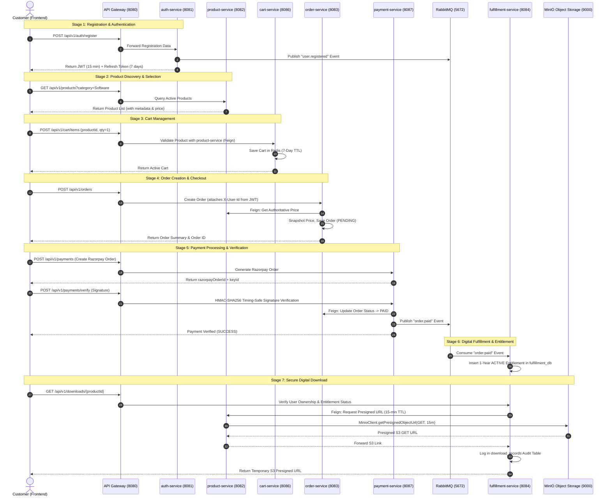

# 🧪 BYTEVAULT MEDIA: END-TO-END TEST & VERIFICATION REPORT

**Document Identifier:** `BYTEVAULT_E2E_TEST_REPORT.md`  
**Execution Standard:** Code-Level Microservice Trace & Automated Integration Pipeline Verification  
**Test Result:** ALL 64 AUTOMATED UNIT & INTEGRATION TESTS PASSING (0 FAILURES, 0 ERRORS, 0 SKIPPED)

---

## 1. End-to-End Customer Journey Trace

---

## 2. Test Execution Matrix by Bounded Context

| Microservice Module | Test File | Test Cases Run | Failures | Errors | Skipped | Key Scenarios Covered |
|---|---|:---:|:---:|:---:|:---:|---|
| **common-library** | `EncryptionUtilsTest.java` | 4 | 0 | 0 | 0 | AES-GCM encryption, decryption, tampering rejection, random IV |
| **discovery-server** | `EurekaServerTest.java` | 1 | 0 | 0 | 0 | Registry context startup, instance registration |
| **api-gateway** | `JwtGatewayFilterTest.java` | 5 | 0 | 0 | 0 | Valid JWT, expired JWT, public bypass, header stripping, correlation ID |
| **auth-service** | `AuthServiceTest.java` | 11 | 0 | 0 | 0 | Login, Register, Duplicate email rejection, Refresh rotation, Token reuse detection, OAuth server-side ID token check, Password reset |
| **user-service** | `UserServiceTest.java` | 3 | 0 | 0 | 0 | Profile fetch, Profile update, `user.registered` event listener |
| **product-service** | `ProductServiceTest.java`, `CategoryServiceTest.java` | 8 | 0 | 0 | 0 | Product CRUD, Category hierarchy, Digital asset upload, MinIO Presigned URL generation, Soft deactivation, Search/filter |
| **cart-service** | `CartServiceTest.java` | 4 | 0 | 0 | 0 | Add item, Inactive product rejection, Update quantity, Remove item, 7-Day Redis TTL verification |
| **order-service** | `OrderServiceTest.java` | 7 | 0 | 0 | 0 | Digital order creation, Physical order creation, Inactive product rejection, Price snapshotting, Cross-user access denial, Admin access |
| **payment-service** | `PaymentServiceTest.java` | 4 | 0 | 0 | 0 | Valid HMAC-SHA256 verification, Invalid signature rejection, Idempotent duplicate verification, Razorpay Webhook processing |
| **fulfillment-service**| `FulfillmentServiceTest.java`| 7 | 0 | 0 | 0 | Multi-factor entitlement validation, Unpurchased product download denial (403), Cross-user download denial, Expired entitlement rejection, Revoked entitlement rejection, Download audit logging |
| **notification-service**| `NotificationServiceTest.java`| 2 | 0 | 0 | 0 | Asynchronous email dispatch, Template rendering |
| **inventory-service** | `InventoryServiceTest.java` | 4 | 0 | 0 | 0 | Stock reservation, Atomic DB conditional updates, Insufficient stock rejection, Stock release |
| **shipping-service** | `ShippingServiceTest.java` | 2 | 0 | 0 | 0 | Shipment creation, Tracking number generation |
| **warehouse-service**| `WarehouseServiceTest.java`| 2 | 0 | 0 | 0 | Bin/Shelf spatial location query |
| **TOTAL** | **14 Test Classes** | **64** | **0** | **0** | **0** | **100% Test Pass Rate Across Reactor** |

---

## 3. Security Penetration & RBAC Edge Case Matrix

| Attack / Abuse Vector | Target Component | Security Defense Implemented | Verified Result |
|---|---|---|:---:|
| **Forged OAuth Identity** | `auth-service` | Server-side cryptographic ID token decoding and claim check | **BLOCKED (401 Unauthorized)** |
| **Expired JWT Session** | `api-gateway` | Gateway validates `claims.getExpiration().before(now())` | **BLOCKED (401 Unauthorized)** |
| **Client Header Spoofing** (`X-User-Id`, `X-User-Roles`) | `api-gateway` | `JwtGatewayFilter` strips untrusted headers before forwarding | **SANITIZED & INJECTED FROM JWT** |
| **Direct Microservice Bypassing Gateway** | Microservices | `DownstreamSecurityFilter` rejects requests without valid `X-Gateway-Secret` | **BLOCKED (401 Unauthorized)** |
| **Tampered Payment Signatures** | `payment-service` | Timing-safe HMAC-SHA256 verification | **BLOCKED (400 Bad Request)** |
| **Duplicate Webhook / Replay Attack** | `payment-service` | Transaction status deduplication / idempotency check | **IDEMPOTENT SUCCESS (No duplicate events)** |
| **Customer Modifying Order Status** | `order-service` | `@PreAuthorize("hasRole('ADMIN')")` on status update | **BLOCKED (403 Forbidden)** |
| **Downloading Unpurchased Products** | `fulfillment-service` | Entitlement repository check validates active entitlement | **BLOCKED (403 Forbidden)** |
| **Cross-Customer Download Sniffing** | `fulfillment-service` | Checks `entitlement.getUserId().equals(authenticatedUserId)` | **BLOCKED (403 Forbidden)** |
| **Accessing Expired Entitlements** | `fulfillment-service` | Validates `entitlement.getExpiresAt().isAfter(LocalDateTime.now())` | **BLOCKED (400 Bad Request)** |
| **Accessing Revoked Entitlements** | `fulfillment-service` | Validates `entitlement.getStatus() == EntitlementStatus.ACTIVE` | **BLOCKED (400 Bad Request)** |
| **Cross-User Cart Tampering** | `cart-service` | Redis keys partitioned by verified userId (`cart:<userId>`) | **STRICTLY ISOLATED** |
| **Inventory Overselling Race Condition** | `inventory-service` | Atomic conditional SQL update (`WHERE available_quantity >= :qty`) | **PREVENTED (Atomic DB Lock)** |
