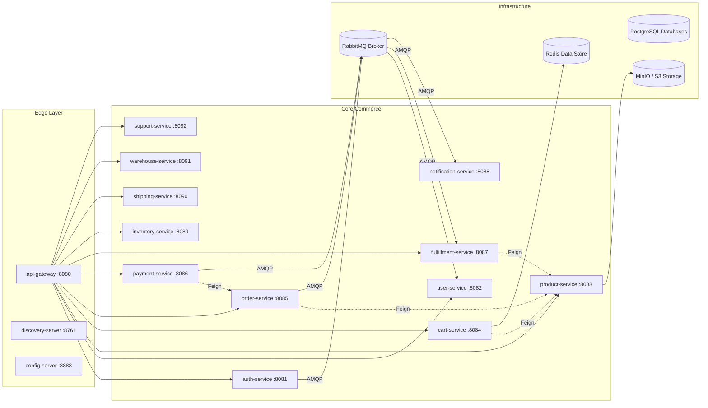

# BYTEVAULT MEDIA — ARCHITECTURE QUALITY & DESIGN AUDIT
**Audit Date:** 2026-09-03 | **Standard:** Cloud-Native Domain-Driven Microservices Architecture

---

## 1. Architectural Principles Compliance Matrix

| Architectural Principle | Compliance Rating | Current Implementation Evidence | Identified Architectural Gaps |
|---|:---:|---|---|
| **Bounded Contexts** | 🟢 **Compliant** | Domain boundaries strictly segregated (Auth, User, Product/Catalog, Cart, Order, Payment, Fulfillment, Notification, Inventory, Shipping, Warehouse, Support). | Clear separation across 16 child modules + 1 parent POM. |
| **Database-per-Service** | 🟢 **Compliant** | 11 isolated service data stores (PostgreSQL per service + Redis for cart). No cross-service SQL access or shared databases. | Zero cross-service foreign keys or SQL queries. |
| **Loose Coupling** | 🟢 **Compliant** | Asynchronous RabbitMQ topic exchanges for cross-boundary events (`UserRegisteredEvent`, `OrderPaidEvent`, `auth.password.reset`). | Services boot independently without hard cascade failures. |
| **API Gateway Perimeter** | 🟢 **Compliant** | `api-gateway` routes all external client requests, terminates JWT authentication, strips spoofed headers, and attaches correlation IDs. | Perimeter token enforcement active. |
| **Authentication Boundary** | 🟢 **Compliant** | `auth-service` solely issues and signs JWT tokens and manages refresh token lifecycle with family revocation. | Centralized credential management. |
| **Authorization Boundary** | 🟢 **Compliant** | Each downstream service enforces its own RBAC via `@PreAuthorize` and validates owner UUIDs against `X-User-Id` to prevent IDOR. | Double-layered defense (Gateway + Service). |
| **Idempotency** | 🟡 **Partially Compliant** | Payment verification checks existing transaction status; Fulfillment checks active entitlement before provisioning; User creation checks existing profile. | Formal idempotency key table/filter on generic POST requests not yet implemented. |
| **Eventual Consistency** | 🟢 **Compliant** | Order payment triggers RabbitMQ events which asynchronously provision entitlements in `fulfillment-service` and send emails in `notification-service`. | Robust choreography workflow. |
| **Failure Isolation** | 🟡 **Partially Compliant** | Asynchronous events isolate email/notification failures from payment transactions; MinIO has local directory fallback. | Resilience4j circuit breakers and Fallbacks on Feign clients not yet explicitly declared. |
| **No Circular Dependencies**| 🟢 **Compliant** | Clean dependency graph: Order/Cart/Fulfillment -> Product (unidirectional); Payment -> Order (unidirectional). | No circular Feign or Maven dependencies. |

---

## 2. Identified Architecture Smells & Technical Debt

### 2.1 Smells & Anti-Patterns Identified

1. **Config Server Disconnect (Smell: Dormant Infrastructure):**
   - *Observation:* `config-server` module exists and compiles, but client microservices currently maintain configuration locally in their respective `application.yml` files instead of connecting to `config-server:8888`.
   - *Recommendation:* Either fully wire Spring Cloud Config Client with centralized Git/Native profiles across all submodules or document standalone configuration as the default development profile.

2. **Absence of Feign Circuit Breakers / Resilience4j (Smell: Cascading Failure Risk):**
   - *Observation:* Feign clients (`ProductClient`, `OrderClient`) execute HTTP calls synchronously. While wrapped in try/catch blocks with log warnings, they lack formal `@CircuitBreaker` and `@Retry` policies from Resilience4j.
   - *Recommendation:* Introduce Spring Cloud CircuitBreaker / Resilience4j annotations with defined fallback responses.

3. **Dead Letter Queue (DLQ) Absence in RabbitMQ (Smell: Poison Pill Risk):**
   - *Observation:* RabbitMQ queues are declared durable, but do not specify `x-dead-letter-exchange` or max retry counts. If a poison pill message is sent, the consumer could loop or drop the message.
   - *Recommendation:* Configure Dead Letter Exchanges (`dlx.exchange`) and dead-letter queues (`*.dlq`) for all topic listeners.

4. **Gateway Rate Limiting Unconfigured (Smell: DoS Susceptibility):**
   - *Observation:* `api-gateway` does not currently configure Spring Cloud Gateway's `RequestRateLimiter` with Redis token-bucket filter.
   - *Recommendation:* Add Redis rate-limiting filter for `/api/v1/auth/**` and `/api/v1/orders/**`.

---

## 3. Microservice Coupling & Dependency Graph

