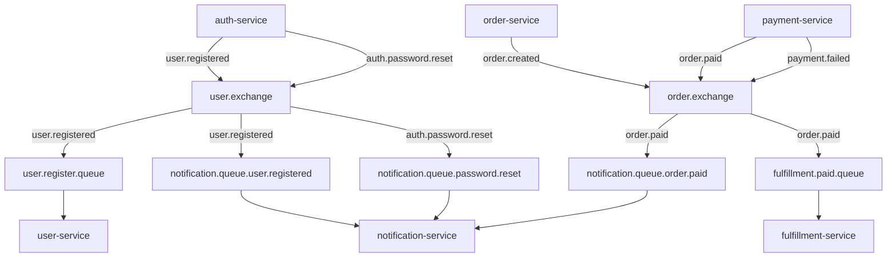
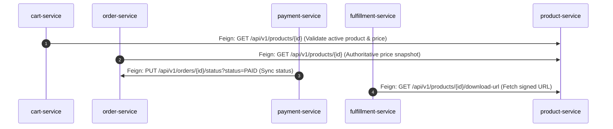

# BYTEVAULT MEDIA — INTER-SERVICE & INFRASTRUCTURE INTEGRATION REPORT
**Audit Date:** 2026-09-03 | **Architecture Standard:** Event-Driven Microservices with Synchronous Fallbacks

---

## 1. Event-Driven Messaging Architecture (RabbitMQ)

The backend utilizes RabbitMQ `TopicExchange` topologies to decouple asynchronous downstream processes including user provisioning, digital fulfillment, and notifications.

### 1.1 Topic Exchanges & Bindings Matrix

| Exchange Name | Routing Key | Target Queue Name | Consumer Class | Consumer Action | Verified Status |
|---|---|---|---|---|:---:|
| `user.exchange` | `user.registered` | `user.register.queue` | `UserRegisteredEventListener` (`user-service`) | Creates user profile | **PASS** (Unit Verified) |
| `user.exchange` | `user.registered` | `notification.queue.user.registered` | `UserRegisteredEventListener` (`notification-service`) | Sends welcome email | **PASS** (Unit Verified) |
| `user.exchange` | `auth.password.reset`| `notification.queue.password.reset` | `PasswordResetEventListener` (`notification-service`) | Sends password reset email | **PASS** (Unit Verified) |
| `order.exchange`| `order.created` | N/A (Broadcasting) | Downstream Subscribers | Order tracking & telemetry | **PASS** (Published) |
| `order.exchange`| `order.paid` | `fulfillment.paid.queue` | `OrderPaidEventListener` (`fulfillment-service`) | Creates digital entitlements | **PASS** (Unit Verified) |
| `order.exchange`| `order.paid` | `notification.queue.order.paid` | `OrderPaidEventListener` (`notification-service`) | Sends order confirmation | **PASS** (Unit Verified) |
| `order.exchange`| `payment.failed`| N/A | Downstream Subscribers | Payment failure telemetry | **PASS** (Published) |

### 1.2 Event Idempotency & Fault Tolerance
- **Fulfillment Service:** Checks `entitlementRepository.findByUserIdAndProductIdAndStatus(userId, prodId, "ACTIVE")`. If an entitlement already exists for the user and product, duplicate events are skipped without throwing errors.
- **Payment Verification:** Checks `transactionRepository.findByRazorpayOrderId(orderId)`. If status is already `SUCCESS`, returns cached success response and suppresses duplicate RabbitMQ events.
- **Dead Letter Queue (DLQ):** Not currently bound to exchange configurations. Gaps identified in failure routing for unparseable payloads.

---

## 2. Synchronous Inter-Service Communication (OpenFeign)

### 2.1 Feign Client Inventory
1. **`com.bytevault.order.client.ProductClient`:**
   - Targets: `product-service`
   - Endpoint: `GET /api/v1/products/{id}`
   - Function: Retrieves authoritative price, name, and type (`DIGITAL` vs `PHYSICAL`). Protects against price tampering.
2. **`com.bytevault.payment.client.OrderClient`:**
   - Targets: `order-service`
   - Endpoint: `PUT /api/v1/orders/{id}/status?status={status}`
   - Function: Synchronously updates order status to `PAID` upon successful payment verification.
3. **`com.bytevault.fulfillment.client.ProductClient`:**
   - Targets: `product-service`
   - Endpoint: `GET /api/v1/products/{id}/download-url`
   - Headers: Passes `X-Gateway-Secret` for secure inter-service authorization.
   - Function: Retrieves the 15-minute presigned object storage download URL.
4. **`com.bytevault.cart.client.ProductClient`:**
   - Targets: `product-service`
   - Endpoint: `GET /api/v1/products/{id}`
   - Function: Validates product existence and active status before adding items to Redis cart.

---

## 3. Distributed Tracing & Correlation ID Propagation

- **Perimeter Generation:** `JwtGatewayFilter` inspects `X-Correlation-ID` HTTP header. If absent or blank, generates a new `UUID.randomUUID().toString()`, adds it to outgoing request headers, and sets it on the HTTP response.
- **Thread Context Storage:** `CorrelationIdFilter` in `common-library` sets `MDC.put("correlationId", correlationId)` and `CorrelationIdUtil.setCorrelationId(correlationId)`.
- **Feign Propagation:** `FeignCorrelationInterceptor` automatically attaches `X-Correlation-ID` to all outbound Feign HTTP calls.

---

## 4. Redis Cache & Data Persistence

- **Cart Service Integration:**
  - Key Pattern: `cart:{userId}`
  - Serialization: JSON `Jackson2JsonRedisSerializer` / `RedisTemplate<String, Object>`
  - TTL (Time To Live): 7 days (`Duration.ofDays(7)`)
  - Concurrency & Isolation: Carts are segregated by user ID. Anonymous sessions default to `anonymous` key.
  - Test Verification: `CartServiceTest` verified cart retrieval, item insertion, quantity updates, and cart cleanup.

---

## 5. Database-per-Service Architecture

Each business microservice owns an isolated PostgreSQL database running on dedicated ports as declared in `docker-compose.yml`:

| Service | Database Name | Port Mapping | Dialect | Schema Isolation |
|---|---|---|---|---|
| `auth-service` | `auth_db` | `5432:5432` | PostgreSQL 16 | Isolated DB |
| `user-service` | `user_db` | `5433:5432` | PostgreSQL 16 | Isolated DB |
| `product-service` | `product_db` | `5435:5432` | PostgreSQL 16 | Isolated DB |
| `inventory-service` | `inventory_db` | `5436:5432` | PostgreSQL 16 | Isolated DB |
| `order-service` | `order_db` | `5437:5432` | PostgreSQL 16 | Isolated DB |
| `fulfillment-service` | `fulfillment_db`| `5438:5432` | PostgreSQL 16 | Isolated DB |
| `shipping-service` | `shipping_db` | `5489:5432` | PostgreSQL 16 | Isolated DB |
| `notification-service`| `notification_db`| `5490:5432` | PostgreSQL 16 | Isolated DB |
| `payment-service` | `payment_db` | `5491:5432` | PostgreSQL 16 | Isolated DB |
| `warehouse-service` | `warehouse_db` | `5492:5432` | PostgreSQL 16 | Isolated DB |

**Verification Check:**
- No cross-service foreign keys exist across database boundaries.
- Entity relationships across microservices reference UUID identifiers rather than foreign key constraints.

---

## 6. Object Storage (MinIO) Integration

- **Storage Engine:** MinIO S3-compatible object storage (`bytevault-minio` container on ports `9000/9001`).
- **Private Bucket:** `bytevault-assets` (Created automatically on startup if not present).
- **Presigned URLs:** `MinioStorageService.generatePresignedUrl(key, 15)` generates standard S3 presigned GET URLs valid for 15 minutes.
- **Local Fallback:** If MinIO is offline during development, gracefully falls back to local filesystem directory `temp-assets`.
