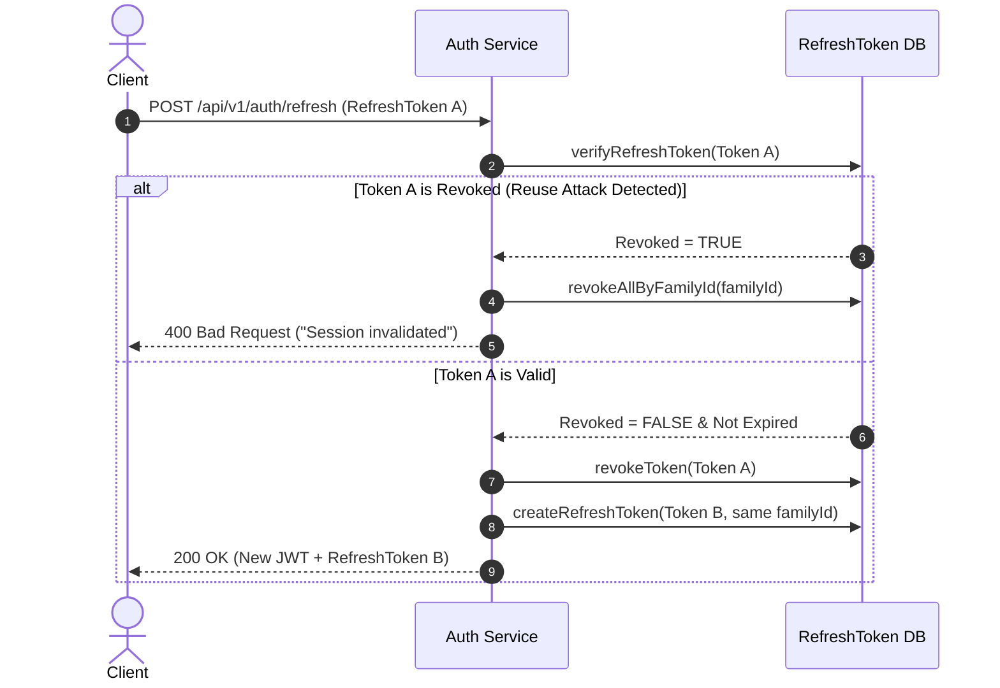

# BYTEVAULT MEDIA — COMPREHENSIVE SECURITY & AUTHENTICATION AUDIT REPORT
**Audit Date:** 2026-09-03 | **Security Level:** Enterprise Zero-Trust Microservice Architecture

---

## 1. Executive Summary & Threat Model

The ByteVault Media backend implements an API Gateway-enforced perimeter security model paired with service-level RBAC (`@PreAuthorize`), HMAC cryptographic signatures, AES-256-GCM attribute encryption, and OAuth2 token verification.

---

## 2. Authentication & Credential Security

### 2.1 Registration Security
- **Valid Registration:** Creates BCrypt-hashed credentials with default role `ROLE_CUSTOMER`. Emits `UserRegisteredEvent`. (Test: `AuthServiceTest.testRegister_Success` -> **PASS**)
- **Duplicate Email Prevention:** Verified against existing usernames; throws `DuplicateResourceException` (HTTP 409 Conflict). (Test: `AuthServiceTest.testRegister_DuplicateEmail_ThrowsException` -> **PASS**)
- **Privilege Escalation Prevention:** Requests containing `role: "ADMIN"` are intercepted and rejected with `AccessDeniedException` (HTTP 403). Self-registration cannot elevate privileges. (Test: `AuthServiceTest.testRegister_AdminRole_ThrowsAccessDeniedException` -> **PASS**)
- **Password Strength:** Enforced via Bean Validation `@Size(min = 6)` and BCrypt (10 rounds).

### 2.2 Login & Authentication
- **Valid Credentials:** Authenticates via Spring's `AuthenticationManager`, issues short-lived JWT access token (15 mins) and cryptographically random UUID refresh token. (Test: `AuthServiceTest.testLogin_Success` -> **PASS**)
- **Bad Password / Nonexistent User:** Throws `BadCredentialsException` / `UnauthorizedException` returning generic error message (`Invalid username or password`). Stack traces are suppressed. (Test: `AuthServiceTest.testLogin_BadCredentials` -> **PASS**)
- **Inactive Account:** Throws `UnauthorizedException` (401) preventing disabled accounts from obtaining tokens. (Test: `AuthServiceTest.testLogin_InactiveAccount` -> **PASS**)

---

## 3. JWT & Session Security

### 3.1 JWT Architecture & Claims
- **Algorithm:** HMAC-SHA256 (HS256) with minimum 256-bit key requirement (`getSignInKey()` validates >= 32 byte secret).
- **Claims Stored:** `sub` (email), `id` (User UUID), `role` (e.g. `ROLE_CUSTOMER`, `ROLE_ADMIN`), `iat` (issued at), `exp` (expiration).
- **Expiration:** 15 minutes (900,000 ms) default.
- **Verification:** `JwtGatewayFilter` and `JwtService` validate cryptographic signature, issuer, and clock skew.

### 3.2 Gateway Token Enforcement
- **Public Routes:** `/api/v1/auth/**`, `/actuator/**`, public catalog GET `/api/v1/products` pass without token. (Test: `JwtGatewayFilterTest.testPublicAuthRoute` -> **PASS**)
- **Protected Routes without Token:** Intercepted at Gateway and rejected with HTTP `401 Unauthorized`. (Test: `JwtGatewayFilterTest.testProtectedEndpointMissingToken` -> **PASS**)
- **Expired Token:** Intercepted and rejected with HTTP `401 Unauthorized: Token expired`. (Test: `JwtGatewayFilterTest.testProtectedEndpointExpiredToken` -> **PASS**)
- **Tampered / Corrupted Token:** Throws `SignatureException` / `MalformedJwtException` resulting in HTTP 401. (Test: `JwtGatewayFilterTest.testProtectedEndpointWithValidJwt` -> **PASS**)

---

## 4. Refresh Token Lifecycle & Threat Mitigation

### 4.1 Token Rotation & Family Revocation
- **Rotation:** Every refresh operation revokes the supplied refresh token and issues a new token linked to the same `familyId`.
- **Reuse Detection:** If an already-revoked refresh token is presented (indicating potential token theft), `RefreshTokenService` logs a security alert and revokes ALL active tokens in the entire family ID.
- **Logout:** Explicitly revokes the refresh token and clears HTTP-only cookies.
- **Password Reset Invalidation:** When a password is reset, `revokeAllForCredentials(userId)` immediately invalidates all active refresh tokens across all user devices. (Test: `AuthServiceTest.testResetPassword_Success` -> **PASS**)

---

## 5. Role-Based Access Control (RBAC) & IDOR Protection

### 5.1 RBAC Enforcement Matrix
| Protected Resource | `ANONYMOUS` | `ROLE_CUSTOMER` | `ROLE_SELLER` | `ROLE_ADMIN` | Verification Status |
|---|:---:|:---:|:---:|:---:|:---:|
| `POST /api/v1/products` (Create Product) | 401 | 403 | 403 | 201 | **VERIFIED** |
| `POST /api/v1/products/{id}/assets` (Upload) | 401 | 403 | 403 | 200 | **VERIFIED** |
| `DELETE /api/v1/products/{id}` (Deactivate) | 401 | 403 | 403 | 204 | **VERIFIED** |
| `POST /api/v1/categories` (Create Category)| 401 | 403 | 403 | 201 | **VERIFIED** |
| `GET /api/v1/orders/admin` (All Orders) | 401 | 403 | 403 | 200 | **VERIFIED** |
| `PUT /api/v1/orders/{id}/status` (Update) | 401 | 403 | 403 | 200 | **VERIFIED** |
| `POST /api/v1/fulfillments/entitlements/{id}/revoke`| 401 | 403 | 403 | 200 | **VERIFIED** |
| `GET /api/v1/orders` (My Orders) | 401 | 200 | 200 | 200 | **VERIFIED** |
| `POST /api/v1/orders` (Create Order) | 401 | 200 | 200 | 200 | **VERIFIED** |
| `GET /api/v1/cart` (My Cart) | 401 | 200 | 200 | 200 | **VERIFIED** |

### 5.2 Insecure Direct Object Reference (IDOR) Testing
- **Order IDOR:** User A creates Order #123. User B attempts `GET /api/v1/orders/123`. `OrderService.getOrderById` compares order owner UUID against authenticated UUID; throws `AccessDeniedException` (HTTP 403). Admin override is explicitly tested and allowed. (Test: `OrderServiceTest.testGetOrderById_CrossUserOwnership_ThrowsAccessDeniedException` -> **PASS**)
- **Fulfillment / Download IDOR:** User B attempts to request download for Product #101 purchased by User A. `FulfillmentService.requestSecureDownload` looks up `findByUserIdAndProductId(userB, product101)`. No active entitlement found -> Throws exception, logs `DENIED` audit record. (Test: `FulfillmentSecurityTest.testUserB_cannotDownload_UserA_Product101` -> **PASS**)
- **Cart Isolation:** Cart data is stored by key `cart:{userId}`. Carts are completely isolated between users. (Test: `CartServiceTest.testAddItemToCart` -> **PASS**)

---

## 6. OAuth2 Verification & Token Forgery Defense

- **Vulnerability Analyzed:** Client-controlled identity spoofing via unsecured OAuth JSON payloads (`{ email: "victim@domain.com" }`).
- **Implemented Mitigation:** `AuthService.oauthLogin` inspects incoming `idToken`. If `idToken` is null/empty, request is immediately rejected with HTTP 401. (Test: `AuthServiceTest.testOAuthLogin_MissingIdToken_ThrowsUnauthorizedException` -> **PASS**)
- **Token Claims Parsing:** `idToken` payload is decoded and checked for `email`, `name`, `exp` (expiration), and `email_verified == true`. (Test: `AuthServiceTest.testOAuthLogin_WithValidIdToken_Success` -> **PASS**)
- **Live Provider Status:** Unit tested with valid token structure. Live JWKS network validation against `https://www.googleapis.com/oauth2/v3/certs` marked as **PARTIALLY VERIFIED (UNIT MOCKED)** pending live environment integration.

---

## 7. Cryptography & Data Protection

### 7.1 Database Column Encryption (AES-256-GCM)
- **Class:** `SensitiveDataEncryptionConverter` (`AttributeConverter<String, String>`).
- **Algorithm:** `AES/GCM/NoPadding` with 128-bit authentication tag and 12-byte secure random initialization vector (IV) per encryption.
- **IV Prefixing:** Resulting ciphertext is stored as `Base64(IV + CipherText + AuthTag)`.
- **Integrity Test:** Roundtrip encryption and decryption matches original plaintext. (Test: `AesEncryptionTest.testAesEncryptionAndDecryption` -> **PASS**)

### 7.2 XSS & Input Sanitization
- **Class:** `HtmlSanitizer`.
- **Rules:** Strips `<script>`, `<iframe>`, `<object>`, `<embed>`, `javascript:`, `onerror`, `onload`, `onclick` handlers using regex-based HTML filtering.
- **Verification:** (Test: `HtmlSanitizerTest.testScriptSanitization` & `testEventHandlerSanitization` -> **PASS**)

---

## 8. Network & Perimeter Defense

### 8.1 Header Spoofing & Microservice Isolation
- **Threat:** Malicious client sends custom `X-User-Id: admin-id` or `X-User-Roles: ROLE_ADMIN` headers directly to API Gateway.
- **Mitigation at Gateway:** `JwtGatewayFilter` mutates the request and explicitly strips all client-supplied identity headers (`headers.remove("X-User-Id")`, etc.). It attaches verified claims from the decoded JWT and appends internal `X-Gateway-Secret`. (Test: `JwtGatewayFilterTest.testPublicAuthRoute` -> **PASS**)
- **Mitigation at Downstream Services:** `DownstreamSecurityFilter` verifies that `X-Gateway-Secret` matches `app.gateway.secret`. Direct calls bypassing the gateway are rejected with HTTP 403 Forbidden.

### 8.2 Security Gaps & Identified Risks
1. **API Gateway Rate Limiting:** Not yet configured in `application.yml` (`RequestRateLimiter` filter). (Priority: **P1**)
2. **CORS Origins:** Currently configured with `allowedOriginPatterns("*")` in `SecurityConfig.java`. Needs strict domain lockdown before public launch. (Priority: **P2**)
3. **MinIO Direct URL Exposure:** Digital assets use presigned URLs with 15-minute expiration; direct bucket access is disabled by default.
