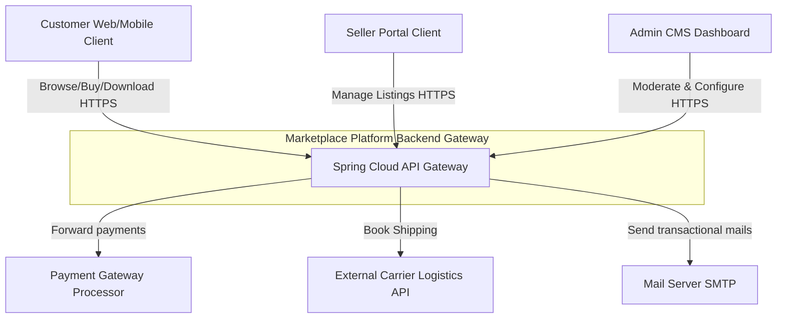
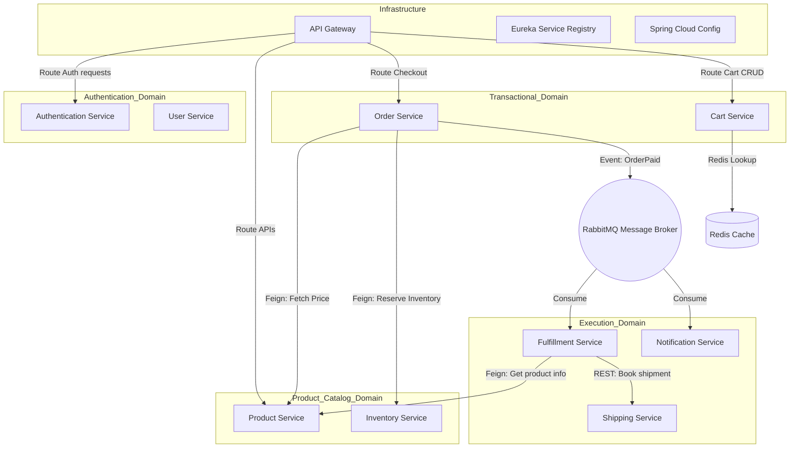
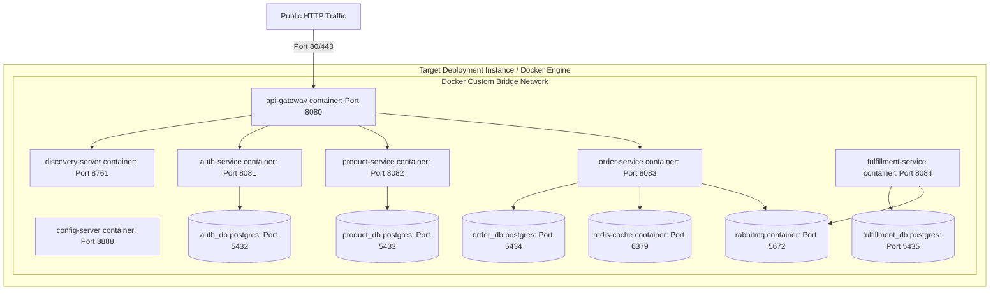
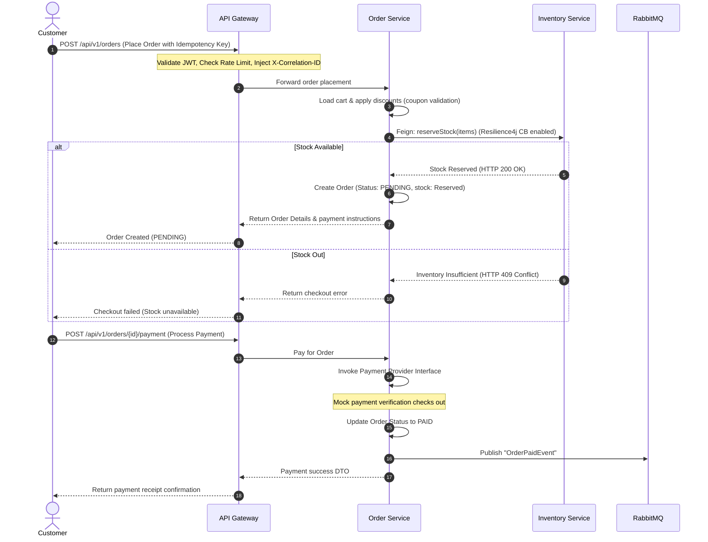
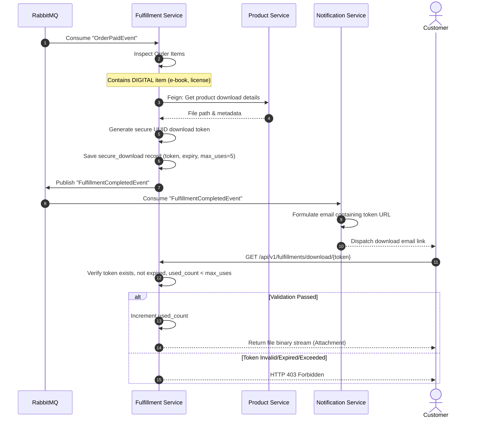
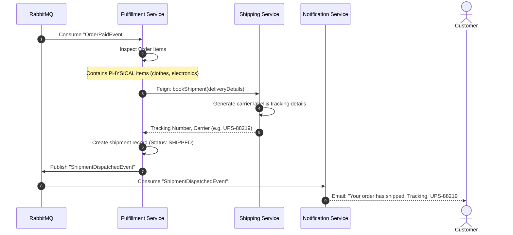
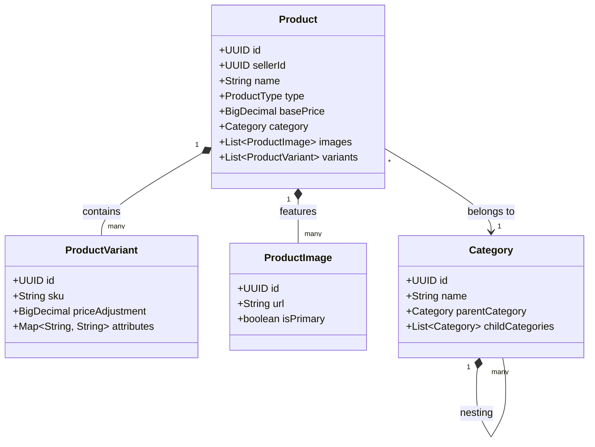
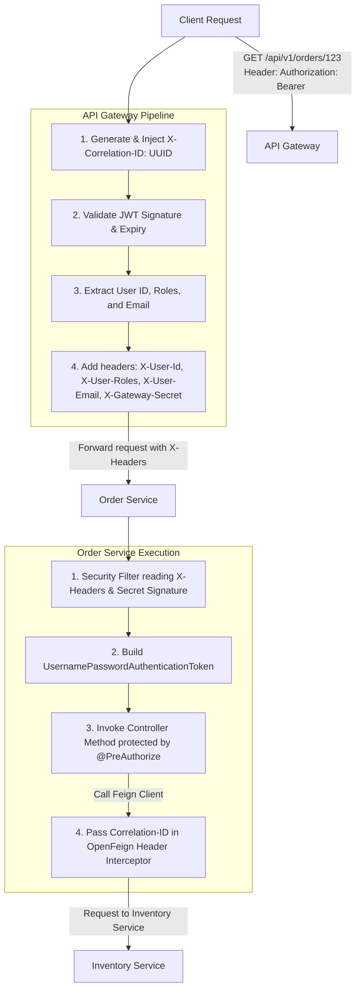

# System Architecture Design Document (Phase 1)
## Project Title: Digital Product & Physical Product Marketplace Platform

This document describes the high-level and low-level system architecture of the Marketplace Platform. It covers the system topology, component interactions, deployment architecture, data flows, and design patterns, satisfying the requirements of **Phase 1 – Architecture Design**.

---

## 1. High-Level Architecture & Technical Justification

The platform is designed around a **decoupled microservices architecture** operating behind a central **API Gateway** with a **Database-per-Service** design. The services are discoverable via a **Eureka Registry** and share centralized settings from a **Spring Cloud Config Server**.

### 1.1 Architectural Decision Record (ADR) & Justifications

#### ADR 1: Database-per-Service
- **Decision**: Each business microservice owns its database. Microservices cannot directly query databases of other services.
- **Justification**: Eliminates tight database-schema coupling. Allows database technology scaling per service (e.g., PostgreSQL for orders, Redis for carts, Elasticsearch for products). Ensures that if one database crashes, it does not bring down the entire ecosystem.
- **Data Consistency**: Handled via asynchronous event-driven propagation (using RabbitMQ) or dynamic runtime checks via REST client adapters (OpenFeign).

#### ADR 2: Java 21 Virtual Threads (Project Loom)
- **Decision**: Run all services on Java 21 with Virtual Threads enabled (`spring.threads.virtual.enabled=true`).
- **Justification**: Traditional thread-per-request models limit concurrency to the size of the operating system thread pool. Virtual threads are lightweight threads managed by the JVM, allowing the application to support hundreds of thousands of concurrent I/O-bound requests (e.g., waiting for database queries or HTTP Feign responses) without depleting server thread pools. This directly addresses the **100,000 concurrent user** scalability target.

#### ADR 3: API Gateway Claims Propagation & Defense-in-Depth Security
- **Decision**: API Gateway validates the JWT, decodes claims, and forwards them downstream in custom HTTP headers (`X-User-Id`, `X-User-Roles`, `X-User-Email`) along with a shared secret signature header (`X-Gateway-Secret`) to verify the request originated from the gateway. Downstream services enforce `@PreAuthorize` methods using their local security filters validating the header secret and loading the role context.
- **Justification**: Defense-in-depth architecture. Validating signature headers at the service level prevents direct client bypassing of the gateway if internal network ports are exposed. Using the secret signature avoids expensive cryptographic JWT validation on every downstream service.

#### ADR 4: RabbitMQ Event Broker for Async Workflows
- **Decision**: Use RabbitMQ for decoupled, transactional activities like Fulfillment trigger, Notifications, and Shipping status updates.
- **Justification**: Processing fulfillment during checkout makes the REST endpoint block and increases latency. Moving these tasks to asynchronous queues ensures immediate response to the client during checkout while ensuring fulfillment processing succeeds even during peak volumes.

#### ADR 5: Feign vs. Async Messaging (Hybrid Communication Model)
- **Decision**: Use **OpenFeign REST clients** for synchronous query dependencies (e.g., Order Service checking inventory availability, or Cart Service fetching product price). Use **RabbitMQ** for state-changing notifications and fulfillment updates.
- **Justification**: Synchronous querying provides real-time validation before transactions complete. Asynchronous events support eventual consistency, minimizing latency.

#### ADR 6: Circuit Breakers and Fallbacks (Resilience4j)
- **Decision**: Integrate Resilience4j circuit breakers and rate limiters on all Feign communication endpoints (e.g., Order -> Product lookup, Order -> Inventory reservation).
- **Justification**: Prevents cascading failures. If the Product Service is down or experiencing latency, the Order Service's circuit breaker trips, returning a fast fallback error message (e.g., cache-based products or a meaningful user warning) instead of resource exhaustion due to connection timeouts.

#### ADR 7: Idempotency Key Enforcements
- **Decision**: Restful mutation endpoints (like POST `/api/v1/orders` and POST `/api/v1/orders/{id}/payment`) will require an `X-Idempotency-Key` header (UUID generated by client). The request status is cached in Redis for 10 minutes. Subsequent matching requests within the window receive the cached response without duplicate execution.
- **Justification**: Prevents duplicate charges and order creation anomalies caused by network timeouts or repeated button clicks by the customer.

#### ADR 8: Storage Service Abstraction
- **Decision**: Implement a `StorageService` interface with implementations: `LocalStorageService` (for local development) and `S3StorageService` (for production AWS/MinIO integration).
- **Justification**: Decouples the Fulfillment Service from physical storage mechanisms. Swapping local directories for S3 buckets only requires a config profiles adjustment without code modifications.

#### ADR 9: Structured Inventory Reservations State Model
- **Decision**: Model stock counts within three logical states: `Available` -> `Reserved` (temporary lock during checkout) -> `Sold` (permanently deducted on payment success), or returned to `Available` (on checkout timeout or payment failure).
- **Justification**: Ensures inventory is locked when a user goes to pay, avoiding overselling during high concurrent flash sales.

#### ADR 10: Transactional Outbox Pattern (Future Enhancement)
- **Decision**: Ensure transactional consistency by using outbox tables in Order/Fulfillment databases. Events are saved in the database in the same transaction as the entities, and published by a separate worker thread.
- **Justification**: Prevents data inconsistency if a database commit succeeds but the RabbitMQ broker goes offline momentarily.

---

## 2. Architecture Diagrams

### 2.1 System Context Diagram (C1 Model)
Defines the boundary of the Marketplace Platform, showing how external actors interact with the system.

---

### 2.2 Component Diagram (C2 Model)
Highlights the microservices within the system boundary and their primary communication flows.

---

### 2.3 Deployment Diagram
Illustrates how the services are containerized and deployed on hardware/virtual environments using Docker Compose, detailing the isolated database instances.

---

## 3. Core Sequence Diagrams

### 3.1 Order Checkout Sequence Diagram
Shows the end-to-end checkout and payment flow.

---

### 3.2 Digital Fulfillment Workflow Sequence Diagram
Tracks how digital products are fulfilled asynchronously.

---

### 3.3 Physical Fulfillment Workflow Sequence Diagram
Tracks physical product shipments.

---

## 4. Class Diagrams

Core domain relationships and interfaces inside the **Product** and **Fulfillment** domains.

---

## 5. Request Flow & Security Context Propagation Diagram

Traces how Correlation IDs and User Claims flow through the microservice boundaries.

